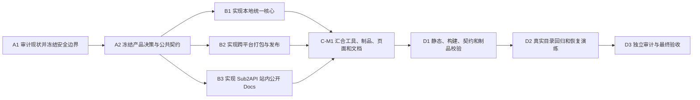

# Codex 本地记忆统一工具开发 SSOT

## 1. 业务结论与范围

### 术语说明

- **Codex 本地状态**：用户电脑上的记忆、活动任务、归档任务和相关配置结构。
- **认证状态**：开放授权登录（OAuth）信息、应用程序接口密钥和其他凭据。认证状态必须与本地记忆分开管理。
- **接口中转服务的服务端连续性**：对经过接口中转服务（Sub2API）的新请求保存已经完成的轮次，以便上游账号变化后继续请求。它不是本地 Codex 记忆。
- **状态清单**：列出文件路径、类型、大小、修改时间和安全摘要（SHA-256）的机器可读文件，不包含凭据正文。

### 1.1 要解决的问题

同一位用户可能先用官方账号的开放授权方式登录 Codex，之后改用接口中转服务（Sub2API）或其他自定义接口。模型提供方发生变化时，用户不应失去同一台电脑上的记忆与任务记录。

本项目要提供一个可从接口中转服务（Sub2API）站内公开文档获取的本地工具。用户打开该网站时，首屏或全局导航必须出现无需登录的“文档”入口；工具下载、校验、使用和恢复说明都从该入口进入。工具必须让所有模型提供方继续指向同一套本地 Codex 状态，同时保持不同认证凭据互不合并。

### 1.2 第一目标

1. 在 macOS、Windows 和开源桌面操作系统（Linux）上识别来源 Codex 状态，自动设置统一的 Codex 状态根目录（`CODEX_HOME`），并覆盖三个持久状态目录。
2. 审计来源目录，拒绝凭据文件、路径穿越、符号链接逃逸和损坏文件。
3. 在任何写入前生成可恢复快照、状态清单和安全摘要（SHA-256）校验。
4. 内容不同的任务均保留并标注来源；仅当任务身份和内容摘要均一致时去重，绝不自动覆盖。
5. 以结构化方式修改必要配置，不整体替换 Codex 配置文件（`~/.codex/config.toml`）。
6. 在接口中转服务（Sub2API）的站内公开文档中提供版本、平台、下载、校验、使用、恢复和卸载说明。
7. 保持服务端连续性与本地状态统一相互独立，避免把内存数据库（Redis）或关系数据库（PostgreSQL）描述成 Codex 记忆库。
8. 以方便 Codex 调用的脚本/命令行工具交付第一版。

### 1.3 明确不做

- 不合并、不上传、不输出认证文件（`auth.json`）、开放授权令牌、应用程序接口密钥或系统钥匙串内容。
- 不宣称能够读取或统一不同官方聊天账号的云端私有记忆。
- 不迁移正在进行的流式响应、工具调用或 WebSocket 连接。
- 不默认把本地历史上传到接口中转服务（Sub2API）。
- 不使用本地对话索引工具（LCO），也不依赖其索引。
- 不把接口中转服务的内存数据库（Sub2API Redis）当作持久记忆。
- 不为接口中转服务（Sub2API）的不同用户共享历史；租户隔离失败必须直接拒绝。
- 三平台脚本制品必须在维护者 Mac 本机完成双重构建、逐字节复现、清单与 SHA-256 回读、共同 Python 核心执行和启动器合同检查；GitHub hosted CI 与 Artifact Attestation 仅是可选增强，不阻塞第一版完成。
- 第一版不包含任何本地历史到接口中转服务（Sub2API）服务端的导入。

### 1.4 成功定义

用户在停止活动请求后，由脚本提示迁移影响、生成快照并在明确确认后自动设置统一的状态根目录（`CODEX_HOME`）。用户把模型提供方配置（`model_provider`）从开放授权对应项切换为接口中转服务（Sub2API）或其他自定义项后，仍可看到同一台电脑上的原有本地记忆和任务记录；认证凭据保持独立，配置中的功能开关、记忆设置、模型提供方定义、配置档案和项目可信条目保持不变。

### 1.5 已拍板的站内文档决定

产品负责人已确认：这里的“文档”是外部用户打开接口中转服务（Sub2API）网站时可访问的站内公开文档，不是项目目录中的开发说明，也不是 Obsidian 审计副本。

- 公共文档中心使用公开入口（`/docs`），无需登录。
- Codex 记忆统一工具使用公开详情页（`/docs/codex-memory`），并从文档中心进入。
- 登录页或未登录首屏与全局导航必须提供“文档”入口，用户不需要先进入管理员后台。
- 管理员订阅页面（`/Api_subscribe`）保持管理员权限，可增加文档链接，但不能成为唯一入口。
- 页面、下载版本和校验值随接口中转服务（Sub2API）前端同源发布，并读取同一发布清单。
- Obsidian 快照和手机提醒仅服务内部开发审计，不出现在用户文档、运行依赖或产品验收链中。

## 2. 输入一致性审查

| 承诺行为 | 当前依据 | 一致性结论 | 规划处理 | 前置节点 |
|---|---|---|---|---|
| provider 切换后继续使用本地记忆 | Codex 状态位于用户本地目录，不由 provider 决定 | 可实现 | 固定同一 `CODEX_HOME`，分层审计与合并 | A1、A2 |
| 不同登录方式产生的“记忆”全部自动统一 | OAuth 云端私有数据不可由 Sub2API反向导出 | 语义冲突 | 将范围限定为用户本机已有状态；云端私有数据明确不做 | A1 |
| 从站内公开文档下载安装 | 当前没有公开文档中心，`/Api_subscribe` 需要管理员权限 | 缺页面，入口行为已拍板 | 新建 `/docs` 和 `/docs/codex-memory`，并引用唯一发布清单 | A2、B3 |
| 服务端跨上游账号继续新请求 | 已有持久连续性纵切和数据库迁移 | 部分已实现 | 作为既有边界引用，不重复规划为本地工具 | A1 |
| 导入本机历史到服务端 | 现有说明明确尚未实现，且第一版明确排除 | 缺身份、接口和生命周期契约 | 仅放入后续独立执行切片 | S2-A1 |
| 外部用户自助导出和删除 | 当前没有对应公开接口 | 缺端点与权限契约 | 服务端导入开放前必须补齐 | S2-B1 |
| macOS、Windows、Linux 第一版同时可用 | 产品负责人已拍板三平台 | 已决定，尚未实现 | A2 冻结统一清单与平台路径合同，B1/B2 实现和打包 | A2、B1、B2 |
| 自动统一 `CODEX_HOME` | 产品负责人已批准自动迁移并提醒用户 | 已决定，尚未实现 | 预检、快照、显式确认、原子提交和恢复；凭据排除，配置结构保真 | A2、B1、D2 |
| 第一版服务端历史导入 | 产品负责人已决定不纳入 | 已决定 | 仅保留未来 S2 切片 | S2-A1 |

## 3. 全局事实来源收敛

### 术语说明

事实来源是开发完成后唯一可以定义某项行为的位置。证据副本和用户文档只能引用它，不能另起一套互相冲突的规则。

| 事实类型 | 唯一权威位置 | 规划动作 |
|---|---|---|
| 产品边界和安全不变量 | 本 SSOT 验收后晋升到 `docs/CODEX_PROVIDER_INDEPENDENT_MEMORY.md` | A1 冻结，C-M1 统一回写 |
| 本地工具清单格式与冲突规则 | 待 A2 冻结的 `tools/codex-memory-unifier/spec/manifest.schema.json` 和核心库 | 不允许页面或脚本各自定义 |
| 配置修改规则 | 工具核心库中的 TOML 结构化编辑模块及契约测试 | 禁止字符串拼接或整体覆盖配置 |
| 下载版本和校验值 | GitHub Release `codex-memory-v0.1.0` 的不可变制品、校验文件和单一发布清单 | 官网和文档只读取该清单，不另存手写版本 |
| 站内公开文档入口 | `frontend/src/router/index.ts` 及待建立的公开文档页面 | 固定 `/docs` 与 `/docs/codex-memory`；`/Api_subscribe` 只提供辅助链接 |
| 服务端连续性数据 | `backend/migrations/183_codex_continuity.sql` 与对应服务、仓库层 | 只引用，不混成本地记忆 |
| 服务端连续性配置 | `backend/internal/config/config.go`、`deploy/config.example.yaml` | 继续保持按 API 密钥灰度 |
| 验收与门禁 | 项目测试、质量脚本和本 SSOT 的完成定义 | 不建立第二套口径 |

## 4. 产品流程

### 4.1 本地统一流程

```text
停止活动流式请求和工具调用
  -> 发现来源状态并提示将自动统一 CODEX_HOME
  -> 只读审计三个状态目录和 config.toml 结构
  -> 排除凭据、非法路径和损坏文件
  -> 生成状态清单、SHA-256 和可恢复快照
  -> 展示目标 CODEX_HOME、空间、合并计划与冲突
  -> 用户明确确认
  -> 原子生成独立合并结果并结构化设置统一 CODEX_HOME
  -> 回读校验并生成恢复命令
  -> 用户验收后再主动决定是否清理旧来源数据
  -> 用户切换 provider 后验证记忆和任务仍可见
```

### 4.2 状态分层

| 层 | 位置 | 是否统一 | 规则 |
|---|---|---|---|
| 记忆 | `$CODEX_HOME/memories/` | 是 | 保留目录结构，逐文件校验；差异内容均保留并记录来源 |
| 活动任务 | `$CODEX_HOME/sessions/` | 是 | 不拼接 JSONL；仅任务身份和摘要均一致时去重 |
| 归档任务 | `$CODEX_HOME/archived_sessions/` | 是 | 保留原任务文件、时间信息和来源侧车元数据 |
| Codex 配置 | `~/.codex/config.toml` | 仅做必要结构化修改 | 不删除既有段落，不替换整份文件 |
| 认证凭据 | `~/.codex/auth.json`、环境变量、钥匙串 | 否 | 不读取正文、不复制、不上传 |
| 临时路由状态 | Sub2API Redis | 否 | 只用于亲和与租约 |
| 服务端已完成轮次 | Sub2API PostgreSQL | 后续可选 | 必须按用户和 API 密钥隔离 |

## 5. 接口中转服务的站内公开文档

外部用户打开接口中转服务（Sub2API）时，必须能从首屏或全局导航直接进入公开文档中心（`/docs`），无需注册或登录。Codex 记忆统一工具的详情页（`/docs/codex-memory`）至少包含：当前稳定版本、macOS、Windows 和开源桌面操作系统（Linux）的系统要求、GitHub 发布区（Releases）下载链接、安全摘要（SHA-256）、脚本安装命令、审计命令、合并命令、恢复命令、卸载方式、数据边界、常见错误和安全说明。

管理员订阅页面（`/Api_subscribe`）不改成公开页面。该页可以增加文档链接，但实际下载和说明必须由站内公开文档承载。所有页面必须读取同一发布清单，不能手写不同版本号。Obsidian 和手机提醒不属于外部文档交付面。

Codex 记忆工具（Codex Memory）的功能代码与通用文档源文件共同保存在本项目团队维护的接口中转服务派生仓库（Sub2API fork）中，并随同一变更接受版本控制和审查。原始接口中转服务（Sub2API）父仓库不是当前事实来源或发布依赖。站内页面渲染派生仓库（fork）中的通用内容，并从部署配置叠加当前域名、下载镜像、支持渠道和发布版本；不得把这些实例信息写回通用文档形成分叉。

## 6. 安全模型

1. **提醒后确认**：脚本可以自动设置状态根目录（`CODEX_HOME`）和迁移状态，但必须先展示影响并取得明确确认；未确认时只做预检和计划。
2. **先快照后写入**：快照失败或空间不足时停止。
3. **凭据隔离**：发现凭据文件进入候选集时直接失败。
4. **路径约束**：拒绝越过状态根的相对路径、符号链接和特殊文件。
5. **原子提交**：在同一文件系统内通过临时目录和原子改名完成；中断后保留原状态。
6. **内容校验**：复制前后比对大小和安全摘要（SHA-256）；任务文件还需通过结构解析。
7. **冲突不覆盖**：差异任务全部保留并用侧车元数据标注来源；仅身份和摘要均一致时去重，任何情况下不自动覆盖。
8. **最小日志**：日志记录相对路径、结果和摘要，不记录任务正文和凭据。
9. **租户隔离**：后续服务端导入必须把用户身份作为数据库查询的强制条件。
10. **连接边界**：切换模型提供方前必须结束活动请求；工具只迁移静态持久状态。

## 7. 实施路径摘要

| 路径 | 目标 | 终点交付物 | 当前结论 |
|---|---|---|---|
| P1 本地核心 | 三平台脚本完成安全审计、自动设置 `CODEX_HOME`、备份、合并和恢复 | 可由 Codex 调用的跨 provider 本地状态统一脚本 | 已实现并通过 19 项本地测试与 D2 演练 |
| P2 发布制品 | 在 Mac 本机为三平台生成可验证脚本制品和发布清单 | GitHub Releases 不可变版本、SHA-256 与本机复现证据 | `0.1.1` 已在本机双重构建且逐字节一致，20 项测试通过；待发布新版 Release |
| P3 站内公开文档 | 外部用户打开 Sub2API 即可找到文档并正确使用 | `/docs`、`/docs/codex-memory`、首屏/导航入口和管理员辅助链接 | 已实现、本地验收并部署到生产；公开路由 HTTP 200 |
| P4 服务端历史 | 未来可能的托管能力 | 非当前 SSOT 的设计备注 | 明确不纳入、不阻塞第一版；服务端连续性保持既有默认 |

## 8. 工程执行附录

### 8.1 版本与修订记录

| Revision | Deviation level | Reason | Changed versions | Affected nodes | Invalidated evidence | Nodes to rerun | Approving authority | Timestamp |
|---|---|---|---|---|---|---|---|---|
| R1 | none | 初始规划 | 1/1/1/1 | 全部 | 无 | 无 | planning authority | 2026-07-23 |
| R2 | L3 | 用户明确“文档”是外部用户打开 Sub2API 时看到的站内公开 Docs，不是 Obsidian 产物 | 2/1/2/2 | A2、B3、C-M1、D1-D3 | R1 的入口待决结论 | A2 及全部下游 | user | 2026-07-23 |
| R3 | L3 | 用户拍板三平台、本机范围、自动统一 CODEX_HOME、脚本形态、GitHub Releases 托管和保留差异任务的冲突策略 | 3/1/3/3 | A2、B1-B3、C-M1、D1-D3 | R2 中对应产品待决结论 | A2 及全部下游 | user | 2026-07-23 |
| R4 | L3 | 用户明确文档随本项目 fork 维护，并将 OP-10 收敛为合并前本地备份、默认不覆盖和可恢复 | 4/1/4/4 | A2、B1、B3、C-M1、D1-D3 | R3 的 OP-07、OP-10 待决结论 | A2 及全部下游 | user | 2026-07-23 |
| R5 | L3 | 用户再次明确三平台构建与验证必须使用本机，纠正错误引入的 hosted CI 与 Artifact Attestation 强制门禁 | 5/1/5/5 | A2、B2、C-M1、D1、D3 | R4 中依赖 hosted CI/attestation 的完成判断 | A2、B2、C-M1、D1、D3 | user | 2026-07-23 |

版本元组为 `(PLAN_VERSION=5, DAG_VERSION=1, INTERFACE_FREEZE_VERSION=5, NODE_CONTRACT_VERSION=5)`。任何范围、安全边界或服务端导入策略变化按 L3 处理。

### 8.2 A-D 阶段与转换门槛

| Stage | Batch/node | Task IDs | Execution mode | Entry gate | Ownership boundary | Forbidden scope | Exit gate | Next node |
|---|---|---|---|---|---|---|---|---|
| A | 基础冻结 | A1 -> A2 | main-agent-serial | 用户批准本 SSOT 的范围 | 契约、清单格式、资源所有权 | 业务实现与部署 | A1、A2 均 `ACCEPTED` | B1、B2、B3 |
| B | 隔离实现 | B1、B2、B3 | bounded parallel batch B-1 | A2 `ACCEPTED` | 三个互斥写入范围 | 共享路由、发布清单最终文件、生产环境 | 三节点均 `ACCEPTED` | C-M1 |
| C | 一级汇合 | C-M1 | main-agent-serial | B1、B2、B3 均 `ACCEPTED` | 共享集成文件、最终发布清单和文档索引 | 未声明的后端连续性代码 | C-M1 `ACCEPTED` | D1 |
| D | 串行终验 | D1 -> D2 -> D3 | main-agent-serial | C-M1 `ACCEPTED` | 验证和审计证据 | 新增功能 | 三节点依次 `ACCEPTED` | 完成 |

### 8.3 依赖图



| From | To | Required upstream state | Transferred input | Gate/evidence |
|---|---|---|---|---|
| A1 | A2 | `ACCEPTED` | 现状清单、安全不变量、权威路径 | Stage A 审计证据 |
| A2 | B1 | `ACCEPTED` | 清单格式、冲突规则、平台范围 | 接口冻结记录 |
| A2 | B2 | `ACCEPTED` | 平台矩阵、版本与制品证明契约 | 接口冻结记录 |
| A2 | B3 | `ACCEPTED` | 已拍板公开路由、发布清单、文档结构 | 接口冻结记录 |
| B1 | C-M1 | `ACCEPTED` | 核心库、命令行接口、契约测试 | 节点证据包 |
| B2 | C-M1 | `ACCEPTED` | 安装包、校验文件、发布候选清单 | 节点证据包 |
| B3 | C-M1 | `ACCEPTED` | 页面、文档和路由测试 | 节点证据包 |
| C-M1 | D1 | `ACCEPTED` | 集成快照和统一发布清单 | 汇合证据 |
| D1 | D2 | `ACCEPTED` | 可执行候选与静态验证结果 | D1 证据 |
| D2 | D3 | `ACCEPTED` | 真实目录演练与恢复结果 | D2 证据 |

图检查：节点编号唯一；无自依赖；无环；所有 B 节点均进入 C-M1；D 阶段仅由已验收的 C-M1 解锁。

### 8.4 SSOT 查找与同步修改

| 对象 | 权威路径 | 查找结果 | 规划动作 | 节点 | 验收证据 |
|---|---|---|---|---|---|
| 服务端连续性边界 | `docs/CODEX_OAUTH_MEMORY_CONTINUITY_MACRO_CN.md` | 已存在，但混合了已实现与后续设想 | 改成清晰状态表并链接公开工具文档 | A1、C-M1 | 文档交叉链接检查 |
| 连续性服务 | `backend/internal/service/openai_continuity.go` | 已实现 | 本切片只读引用 | A1 | 现有测试通过 |
| 连续性数据 | `backend/migrations/183_codex_continuity.sql` | 已实现 | 本切片不修改 | A1 | 迁移拓扑检查 |
| 连续性配置 | `backend/internal/config/config.go`、`deploy/config.example.yaml` | 默认关闭并支持灰度 | 公开文档说明，不改变默认值 | B3 | 配置文档测试 |
| 管理员订阅页 | `frontend/src/router/index.ts`、`frontend/src/views/admin/AccountSubscriptionsView.vue` | 需要管理员权限 | 仅增加站内公开文档链接 | B3、C-M1 | 路由权限测试 |
| 公开文档中心 | 未定位 | 尚不存在，入口已拍板为 `/docs` | 建立无需登录的 Sub2API 站内文档中心 | B3 | 未登录访问与首屏入口测试 |
| Codex 工具文档页 | 未定位 | 尚不存在，入口已拍板为 `/docs/codex-memory` | 建立下载、校验、使用和恢复详情页 | B3 | 未登录访问、链接与命令测试 |
| 本地工具契约 | 未定位 | 尚不存在 | 在 A2 建立唯一清单格式和核心接口 | A2 | 模式校验与契约测试 |
| 下载发布清单 | 未定位 | 尚不存在 | A2 冻结位置，C-M1 单一写入 | A2、C-M1 | 摘要与制品一致性检查 |
| 外部使用文档 | 本项目 fork 中待建立的文档源文件 | 尚不存在 | 与工具代码共同维护，站点渲染并叠加部署实例信息 | B3 | 链接、渲染与命令测试 |

### 8.5 资源冲突矩阵

| Resource ID | Type | Canonical path/name | Version/snapshot | Node | Access R/W | Isolation key | Conflict decision | Integration owner |
|---|---|---|---|---|---|---|---|---|
| R1 | 文档 | `docs/CODEX_OAUTH_MEMORY_CONTINUITY_MACRO_CN.md` | IFV5 | A1/B3/C-M1 | R/R/W | frozen-doc-v5 | Stage B 只读，C-M1 唯一写 | C-M1 |
| R2 | 工具源码 | `tools/codex-memory-unifier/` | NCV5 | B1 | W | core-b1 | 独占 | B1 |
| R3 | 发布脚本 | 待 A2 冻结的制品目录 | IFV5 | B2 | W | release-b2 | 独占候选目录 | B2 |
| R4 | 前端页面 | `/docs`、`/docs/codex-memory` 及首屏/导航入口组件 | IFV5 | B3 | W | docs-b3 | 独占 | B3 |
| R5 | 路由 | `frontend/src/router/index.ts` | IFV5 | B3/C-M1 | R/W | router-cm1 | B3 提交路由候选，C-M1 最终写入 | C-M1 |
| R6 | 发布清单 | GitHub Releases 中待 A2 冻结的单一清单 | IFV5 | B2/B3/C-M1 | R/R/W | manifest-cm1 | Stage B 不写最终文件 | C-M1 |
| R7 | 本地测试状态根 | 临时 `CODEX_HOME` | fixture-v1 | B1/D2 | W/W | 每测试唯一临时目录 | 隔离目录，禁止使用真实用户目录写测试 | D2 |
| R8 | 构建目录 | 平台独立输出目录 | release-v1 | B2/D1 | W/R | platform-version | 每平台隔离 | D1 |
| R9 | 生产服务 | `43.136.113.101` | `sub2api-local:ae2705973300` | 发布验收 | W/R | immutable-image-id | 仅按部署 Skill 无构建切换并在线回读 | D3 |
| R10 | 现有未跟踪工具 | `tools/sub2api_request_pressure_guard.py` 及测试 | current-worktree | 全部 | 禁止 | user-owned | 与本任务无关，保留 | 无 |

### 8.6 最小可开发单元

#### A1 审计现状并冻结安全边界

- Stage/type：A / `foundation-serial`
- 目标与调用者：为产品负责人和实现者确认本地状态、认证状态、Redis 与 PostgreSQL 的边界。
- 输入：本 SSOT、`source-notes.md`、现有连续性代码和文档。
- 预期输出：范围地图、权威路径清单、安全不变量和已有实现审计。
- 前置依赖：无。
- 并行性：不可并行；它决定所有后续边界。
- 读取范围：本文列出的现有连续性文件、Codex 状态目录结构说明。
- 写入范围：规划晋升后的唯一产品边界文档。
- 接口：只读核对现有服务端接口；发布 `INTERFACE_FREEZE_VERSION=4` 的候选输入。
- 共享资源：产品术语和安全不变量。
- 禁止修改：业务代码、数据库、远端服务、用户真实 Codex 状态。
- 测试与证据：路径存在性检查、现有测试清单、输入一致性表。
- 验收：每种状态只有一个归属；凭据、云端私有记忆和活动连接明确排除。
- 下游：A2。
- 当前状态/尝试：`ACCEPTED` / 1；边界审计已反映在本文、`source-notes.md` 与连续性文档。
- 负责人：主编排者。
- 偏差权限：L1 可本地记录；L2/L3 需规划负责人或用户批准。
- Harness：失败类型为边界混淆；通过文档静态检查和独立审计检测；控制位置为 `docs` 与契约测试。
- 清除：删除任何把 Redis 描述为 Codex 持久记忆的新增文案。
- 完成定义：主编排者将证据审查并设置为 `ACCEPTED`。

#### A2 冻结产品决策与公共契约

- Stage/type：A / `foundation-serial`
- 目标与调用者：把已拍板的三平台、本机发布门禁、公开入口、脚本形态、冲突规则、GitHub Releases 托管、本机范围、fork 文档归属和备份恢复规则变成唯一可实现合同。
- 输入：A1 已验收输出、`openproblem.md` 的人类决定。
- 预期输出：清单模式、命令接口、冲突规则、平台矩阵、已拍板公开路由和发布清单位置。
- 前置依赖：A1 必须 `ACCEPTED`；OP-01 至 OP-10 的当前范围决定均已记录。原 OP-08 和未来服务端托管均属范围外既有或未来事项。
- 并行性：不可并行；Stage B 只读消费此冻结版本。
- 读取范围：`openproblem.md`、前端路由、构建配置、现有文档。
- 写入范围：唯一公共契约、清单模式和冻结记录。
- 接口：发布 `INTERFACE_FREEZE_VERSION=4`。
- 共享资源：发布清单格式、页面地址、工具命令、错误码。
- 禁止修改：实现源码和生产配置。
- 测试与证据：模式自校验、命令帮助快照、路由冲突检查。
- 验收：所有 Stage B 输入可无猜测实现；站内 Docs 固定为 `/docs` 与 `/docs/codex-memory`；其余未决项保持阻塞。
- 下游：B1、B2、B3。
- 当前状态/尝试：`ACCEPTED` / 2；OP-01 至 OP-10 已按 v5 冻结，本机三平台发布门禁、两个 JSON Schema 和命令接口已落地。
- 负责人：产品负责人、主编排者和契约负责人。
- 偏差权限：任何产品边界变化均为 L3。
- Harness：失败类型为契约漂移；通过模式校验和跨文档引用检查检测；控制位置为 `contract`。
- 清除：移除重复或旧版清单草案。
- 完成定义：所有必要决策有权威记录，冻结版本被主编排者验收。

#### B1 实现本地统一核心

- Stage/type：B / `parallel-work`，批次 B-1。
- 目标与调用者：为 macOS、Windows、Linux 本地用户提供可由 Codex 调用的发现、预检、提醒、自动设置 `CODEX_HOME`、快照、计划、合并、回读和恢复脚本。
- 输入：A2 已验收的清单格式、冲突策略和平台范围。
- 预期输出：核心库、命令行工具、测试夹具、失败码和恢复手册片段。
- 前置依赖：A2 `ACCEPTED`。
- 并行性：可与 B2、B3 并行；写入范围互斥。
- 读取范围：冻结契约、临时 Codex 目录夹具。
- 写入范围：`tools/codex-memory-unifier/` 及其专属测试目录。
- 接口：消费 IFV5，只能提出变更，不能自行修改冻结契约。
- 共享资源：无；测试使用唯一临时目录。
- 禁止修改：`auth.json`、真实 `~/.codex`、前端、后端、发布清单最终文件。
- 测试与证据：空目录、重复文件、内容冲突、坏 JSONL、路径穿越、符号链接、空间不足、中断恢复、配置保真和跨 provider 回读测试。
- 验收：确认前只读；先快照；确认后自动设置统一 `CODEX_HOME` 并原子写入；差异任务双份保留且来源可查；摘要一致；配置段落不丢失；凭据零读取零复制。
- 下游：C-M1。
- 当前状态/尝试：`ACCEPTED` / 1；19 项单元/制品测试与 D2 场景通过。
- 负责人：边界明确的客户端实现者。
- 偏差权限：L1；涉及配置、认证或冲突规则为 L3。
- Harness：失败类型为数据丢失或凭据泄露；通过故障注入、快照回读和敏感路径哨兵检测；控制位置为 `scripts/qa` 与 `contract`。
- 清除：删除测试临时目录、未引用测试快照和开发期凭据样本；真实用户来源数据和恢复备份不得自动删除，只能由用户确认后主动清理。
- 完成定义：节点测试通过并由主编排者设置 `ACCEPTED`。

#### B2 实现跨平台打包与发布

- Stage/type：B / `parallel-work`，批次 B-1。
- 目标与调用者：为外部用户生成可验证、可追溯的下载制品。
- 输入：A2 的平台矩阵、本机发布门禁、版本、SHA-256 和托管合同；B1 的冻结命令接口只读快照。
- 预期输出：由 Mac 本机生成的三平台制品、SHA-256、双重构建复现证据和候选发布清单。交付为脚本而非原生 macOS 应用，不适用 Apple 公证。
- 前置依赖：A2 `ACCEPTED`。
- 并行性：可并行；不写 B1 源码和最终发布清单。
- 读取范围：冻结工具接口和构建输入。
- 写入范围：平台隔离的构建、证明和候选制品目录。
- 接口：消费 IFV5。
- 共享资源：GitHub 发布身份和制品版本；按平台与版本隔离。
- 禁止修改：前端页面、核心逻辑、最终发布清单、生产站点。
- 测试与证据：在 Mac 本机完成干净目录安装、校验失败拒绝、升级、卸载、两次逐字节一致构建、三平台归档共同核心执行、POSIX 启动器语法和 PowerShell 启动器合同校验。
- 验收：每个支持平台都有不可变制品与匹配摘要；无凭据和用户数据进入包。
- 下游：C-M1。
- 当前状态/尝试：`VERIFIED` / 4；`0.1.1` 已在 Mac 本机双重构建且五个输出逐字节一致，20 项测试与 SHA-256 回读通过；新版 Release 尚未发布，因此暂不标记 `ACCEPTED`。
- 负责人：发布实现者。
- 偏差权限：L1；平台或托管变化为 L2/L3。
- Harness：失败类型为供应链或版本漂移；通过本机双重构建、归档执行、启动器合同、发布清单和 SHA-256 回读检测；控制位置为本地测试与发布脚本。
- 清除：删除摘要不匹配的候选和过期构建目录。
- 完成定义：候选制品证据齐全并被主编排者验收。

#### B3 实现接口中转服务的站内公开文档

- Stage/type：B / `parallel-work`，批次 B-1。
- 目标与调用者：让外部用户打开 Sub2API 时即可从首屏或全局导航进入 Docs，理解边界、下载工具并完成可恢复操作。
- 输入：已拍板的 `/docs`、`/docs/codex-memory`、首屏/导航入口，以及 A2 的文档结构和发布清单合同。
- 预期输出：站内公开文档中心、Codex 工具详情页、首屏/导航入口、本项目 fork 中的通用文档源、当前站点实例说明、管理员页辅助链接和路由测试。
- 前置依赖：A2 `ACCEPTED`。
- 并行性：可并行；只读候选发布清单模式，不写最终版本数据。
- 读取范围：前端设计系统、路由规范、冻结契约、现有连续性文档。
- 写入范围：公开文档页面、首屏或全局导航入口、专属文档和测试。
- 接口：消费 IFV5。
- 共享资源：路由与文档索引在 C-M1 最终写入。
- 禁止修改：工具核心、后端连续性逻辑、生产配置。
- 测试与证据：打开 Sub2API 即可发现 Docs、未登录访问、下载链接、摘要展示、移动端布局、管理员权限不退化、命令示例可执行。
- 验收：未登录用户可从首屏或全局导航进入 `/docs` 并到达 `/docs/codex-memory`；页面不混淆本地记忆与服务端连续性；不承诺云端私有记忆统一；所有版本来自同一清单；不引用 Obsidian 或手机提醒作为产品能力。
- 下游：C-M1。
- 当前状态/尝试：`ACCEPTED` / 2；43 项定向前端测试、类型检查、ESLint、生产构建和桌面/移动视觉验收通过，生产 `/docs` 与 `/docs/codex-memory` 均为 HTTP 200。
- 负责人：前端与文档实现者。
- 偏差权限：L1；公开路由或产品承诺变化为 L3。
- Harness：失败类型为误导、死链或权限回归；通过路由测试、链接检查和文档合同检测；控制位置为 `scripts/quality`、`scripts/qa` 与 `docs`。
- 清除：删除重复版本号、旧下载链接、把 `/Api_subscribe` 误写成公开页的文案，以及把 Obsidian/手机提醒写成用户入口的文案。
- 完成定义：页面与文档节点证据通过并被主编排者验收。

#### C-M1 汇合工具、制品、页面和文档

- Stage/type：C / `convergence`。
- 目标与调用者：形成一个版本、一份发布清单、一个公开入口和一致的安全表述。
- 输入：B1、B2、B3 的已验收返回和版本元组。
- 预期输出：集成快照、最终发布清单、路由与文档索引、变更路径并集和清除清单。
- 前置依赖：B1、B2、B3 全部 `ACCEPTED`。
- 并行性：不可并行；独占共享集成资源。
- 读取范围：三个节点全部交付物和实际变更路径。
- 写入范围：最终发布清单、路由、文档索引、连续性文档交叉链接。
- 接口：核对 IFV5；需要新接口时先按偏差协议处理。
- 共享资源：发布清单、路由、文档索引、集成证据目录。
- 禁止修改：未声明的后端业务逻辑、生产环境。
- 测试与证据：路径重叠检查、摘要匹配、接口语义核对、路由权限、组合测试和清除清单核对。
- 验收：页面展示的版本、摘要和制品完全一致；本地与服务端边界一致；无重复事实来源。
- 下游：D1。
- 当前状态/尝试：`VERIFIED` / 3；代码、文档、路由和 `0.1.1` 单一发布清单已汇合，本机门禁通过；待新版 Release 与生产清单回读。
- 负责人：主编排者。
- 偏差权限：L1；接口变化 L2；范围或安全变化 L3。
- Harness：失败类型为集成漂移；通过发布清单回读和交叉引用检查检测；控制位置为 `contract` 与 `scripts/quality`。
- 清除：删除所有候选清单、重复索引和未引用制品。
- 完成定义：集成输出快照经主编排者验收为 `ACCEPTED`。

#### D1 静态、构建、契约和制品校验

- Stage/type：D / `global-validation`。
- 目标与调用者：验证类型、构建、清单、路由、文档、迁移拓扑和制品完整性。
- 输入：C-M1 已验收集成快照。
- 预期输出：D1 证据包。
- 前置依赖：C-M1 `ACCEPTED`。
- 并行性：串行。
- 读取范围：完整集成快照。
- 写入范围：D1 独立证据目录。
- 接口：验证 IFV5，无权修改。
- 共享资源：隔离构建目录。
- 禁止修改：功能源码、生产环境。
- 测试与证据：前后端静态检查、单元测试、本机双重构建、三平台归档执行、发布清单模式、SHA-256、文档链接和生成物漂移。
- 验收：所有必需检查通过且证据新鲜。
- 下游：D2。
- 当前状态/尝试：`ACCEPTED` / 1；证据见 `evidence/d1-verification.md`。
- 负责人：主编排者。
- 偏差权限：发现问题后按 L1/L2/L3 返回，不在验证节点暗改。
- Harness：失败类型为静态或供应链漂移；控制位置为 `scripts/quality`。
- 清除：清理失败构建的临时输出。
- 完成定义：D1 证据被验收。

#### D2 真实目录回归和恢复演练

- Stage/type：D / `global-validation`。
- 目标与调用者：用合成但真实结构的 Codex 状态根验证跨 provider 连续性和灾难恢复。
- 输入：D1 已验收候选。
- 预期输出：场景矩阵、恢复演练、零凭据访问证明和跨平台结果。
- 前置依赖：D1 `ACCEPTED`。
- 并行性：串行；内部测试仅可使用隔离目录和进程。
- 读取范围：发布候选、测试夹具。
- 写入范围：唯一临时状态根与 D2 证据目录。
- 接口：按 IFV5 运行。
- 共享资源：每场景唯一临时目录；不得连接生产 Sub2API。
- 禁止修改：真实 `~/.codex`、真实凭据、生产环境。
- 测试与证据：OAuth provider 到 Sub2API provider、Sub2API 到自定义 provider、冲突、中断、回滚、损坏文件、大任务记录和配置保真。
- 验收：provider 切换后同一状态可见；恢复后摘要等于原始快照；凭据哨兵未被读取。
- 下游：D3。
- 当前状态/尝试：`ACCEPTED` / 1；证据见 `evidence/d2-acceptance-scenario.json` 与 `evidence/d2-scenario-matrix.md`。
- 负责人：验收负责人。
- 偏差权限：同 D1。
- Harness：失败类型为运行态数据丢失；控制位置为 `scripts/qa`。
- 清除：测试临时状态根与测试制品。
- 完成定义：全部必需场景通过并被验收。

#### D3 独立审计与最终验收

- Stage/type：D / `audit-readonly`。
- 目标与调用者：独立核对原始需求、冻结不变量、实际代码、证据和清除结果。
- 输入：本 SSOT、原始需求、版本元组、C-M1、D1、D2 证据。
- 预期输出：`implementation-completion-audit.md` 和最终完成度表。
- 前置依赖：D2 `ACCEPTED`。
- 并行性：串行，只读，使用独立上下文。
- 读取范围：明确列出的规划、实现、测试和证据路径。
- 写入范围：审计报告。
- 接口：只读核对 IFV5。
- 共享资源：审计证据目录。
- 禁止修改：全部实现、配置、制品和生产环境。
- 测试与证据：逐节点给出 `done`、`partial`、`missing`、`blocked` 或 `not-applicable`，并附路径和命令证据。
- 验收：不存在未声明缺口；清除完成；外部文档不超出真实能力；所有必要节点已经 `ACCEPTED`。
- 下游：无。
- 当前状态/尝试：`VERIFIED` / 3；本机 v5 门禁和 `0.1.1` 候选审计完成，待新版 Release 与生产回读后最终验收。
- 负责人：独立审计者和最终验收负责人。
- 偏差权限：只报告，不修改；发现偏差交回主编排者。
- Harness：失败类型为声明与实现不一致；控制位置为独立审计与 `scripts/qa`。
- 清除：确认所有临时内容已清理。
- 完成定义：审计报告被最终验收负责人设置为 `ACCEPTED`。

### 8.7 节点状态台账

| Task ID | Stage | Versions | State | Attempt | Owner | Blocking reason | Evidence | Unlocks |
|---|---|---|---|---|---|---|---|---|
| A1 | A | 5/1/5/5 | `ACCEPTED` | 1 | 主编排者 | 无 | 本文边界表、`source-notes.md` | A2 |
| A2 | A | 5/1/5/5 | `ACCEPTED` | 2 | 产品/契约负责人 | 无 | `openproblem.md`、两个 JSON Schema | B1/B2/B3 |
| B1 | B | 5/1/5/5 | `ACCEPTED` | 1 | 客户端实现者 | 无 | 20 项 CLI/制品测试、D2 场景 | C-M1 |
| B2 | B | 5/1/5/5 | `VERIFIED` | 4 | 发布实现者 | `0.1.1` 尚未发布 | 本机双重构建、20 项测试、SHA-256 回读 | C-M1 |
| B3 | B | 5/1/5/5 | `ACCEPTED` | 2 | 前端/文档实现者 | 无 | 43 项测试、视觉验收、生产在线 HTTP 200 | C-M1 |
| C-M1 | C | 5/1/5/5 | `VERIFIED` | 3 | 主编排者 | 待 `0.1.1` Release 与生产清单回读 | `0.1.1` 清单、本机门禁、路由与文档集成 | D1 |
| D1 | D | 5/1/5/5 | `ACCEPTED` | 2 | 主编排者 | 无 | `evidence/d1-verification.md` | D2 |
| D2 | D | 5/1/5/5 | `ACCEPTED` | 1 | 验收负责人 | 无 | `evidence/d2-acceptance-scenario.json`、场景矩阵 | D3 |
| D3 | D | 5/1/5/5 | `VERIFIED` | 3 | 独立审计者 | 待 `0.1.1` Release 与生产回读 | `implementation-completion-audit.md`、本机发布证据 | 发布验收 |

规范状态仅允许：`BLOCKED -> READY -> RUNNING -> IMPLEMENTED -> VERIFIED -> ACCEPTED`，失败进入 `FAILED`，已验收证据因上游变化失效时进入 `INVALIDATED`。只有 `ACCEPTED` 解锁下游。

### 8.8 Harness 门禁清单

当前环境未提供 Control-Promotion MCP 调用能力，以下按同等 Harness 字段手工归位。

| 单元 | 失败类型 | 项目不变量 | 检测层 | 控制位置 | 新增 | 证据 |
|---|---|---|---|---|---|---|
| A1 | 状态层混淆 | 本地记忆、认证、Redis、PostgreSQL 分层 | review | docs/contract | 是 | 边界检查报告 |
| A2 | 契约漂移 | Stage B 只读同一冻结接口 | static | contract | 是 | 模式与版本检查 |
| B1 | 数据丢失/凭据泄露 | 先快照、凭据零读取、原子写入 | runtime/readback | scripts/qa | 是 | 故障注入与恢复证据 |
| B2 | 供应链漂移 | 制品、版本、摘要和本机证据一致 | static/readback | local release gate | 是 | 双重构建、归档执行、启动器合同与 SHA-256 |
| B3 | 权限/文档回归 | 公开页可访问，管理员页仍受保护，表述真实 | static/runtime | scripts/quality/scripts/qa/docs | 是 | 路由、链接和文档测试 |
| C-M1 | 集成分叉 | 单一发布清单和单一文档事实来源 | readback | contract/scripts/quality | 是 | 集成清单回读 |
| D1 | 全局静态漂移 | 构建、模式、迁移和生成物一致 | static | scripts/quality | 是 | D1 报告 |
| D2 | 运行态恢复失败 | 跨 provider 后状态可见且可恢复 | runtime/readback | scripts/qa | 是 | 场景矩阵 |
| D3 | 完成声明失真 | 文档承诺不超过真实实现 | review | audit | 是 | 独立审计报告 |

### 8.9 独立审计 lane

- Stage A 审计：只读核对现有服务端连续性、前端路由、现有文档和缺口，避免重复规划。
- Stage C 后审计：在 C-M1 汇合完成后，整批核对工具、制品、页面和文档，不以单个节点的自报结论代替集成审计。
- D3 审计：使用独立上下文，只传原始需求、本 SSOT、权威路径、节点清单和验证命令，不传主编排者的预期结论。
- 审计输出：`agents-results/2026-07-23/codex-provider-independent-memory-tool/implementation-completion-audit.md`。
- 本次以 Mac 本机发布门禁和真实 Release/生产回读为完成证据，不把 GitHub hosted CI 或 Artifact Attestation 作为必需门禁。

### 8.10 执行者分配与返回合同

实施时，子任务必须使用最小必要上下文，不得复制完整长任务历史、原始附件或大段工具输出。每个执行者返回：

```yaml
task_id: B1
worker_role: bounded-worker
versions:
  plan: 4
  dag: 1
  interface_freeze: 4
  node_contract: 4
attempt: 1
starting_state: RUNNING
proposed_state: VERIFIED
actual_read_scope: []
actual_write_scope: []
interfaces_consumed: []
shared_resources_used: []
change_summary: []
commands: []
unverified_items: []
deviation:
  level: none
  description: ""
shared_resource_impact: []
remaining_risks: []
acceptance_self_check: pass
```

执行者不能自行设置 `ACCEPTED`。版本过期、越界写入、缺少命令结果或隐瞒共享资源影响时，主编排者拒绝返回。

### 8.11 偏差协议与失效传播

| 等级 | 适用情况 | 动作 | 版本变化 | 批准人 |
|---|---|---|---|---|
| L1 | 不改变接口、依赖、边界和验收的局部修正 | 在节点返回记录并在原范围修正 | 无强制变化 | 主编排者 |
| L2 | 改变依赖、批次、资源所有权或验证顺序 | 暂停相关节点，更新 DAG 和资源矩阵，失效受影响证据 | 至少增加 `DAG_VERSION` | 规划负责人 |
| L3 | 改变产品范围、认证/隐私边界、架构或事实来源 | 停止路径并重新规划 | 增加 `PLAN_VERSION` 及所有受影响版本 | 用户或规划权威 |

已验收上游进入 `INVALIDATED` 时，所有依赖其输出的下游节点同步失效。修复后只能在依赖、版本和资源重新核对后回到 `READY`，并增加尝试次数。

### 8.12 清除清单

| 范围 | 类型 | 内容 | 处理方式 | 允许保留 |
|---|---|---|---|---|
| 全局 | 文档 | 把 Redis、provider 或 OAuth 账号描述为本地记忆权威，或把 Obsidian/手机提醒描述为用户文档入口的文案 | 删除或改写 | 否 |
| 全局 | 配置 | 为单一 provider 整体生成的 `config.toml` | 禁止生成；发现测试样本则删除 | 否 |
| B1 | 数据 | 未完成写入、临时合并目录、未引用测试快照 | 验证后删除 | 否 |
| B1 | 凭据 | 任何进入候选集的凭据副本 | 测试立即失败并删除测试副本 | 否 |
| B2 | 制品 | 无证明、摘要不匹配或过期候选 | 删除 | 否 |
| B3 | 页面 | 重复版本号、旧链接、第二发布清单 | 删除 | 否 |
| C-M1 | 集成 | 候选清单、重复文档索引 | 最终清单验收后删除 | 否 |
| D | 运行态 | 测试状态根、测试进程、测试端口和构建目录 | 终验后删除 | 否 |
| 服务端 | 存量数据 | 本地工具第一版不写服务端 | 声明无存量 | 不适用 |
| 用户本地 | 来源数据与恢复备份 | 合并前自动创建的本地备份及未覆盖来源数据 | 默认保留；仅在用户确认合并结果后由用户主动覆盖或清理 | 是 |

### 8.13 禁止项检查

- 调用方同步切换结论：外部 Codex 客户端不可由 Sub2API同步升级，因此本工具采用显式用户安装和单一新格式，不修改 Codex 内部协议。
- 不可同步消费者的前置解决：A2 冻结工具自身的公开合同；不依赖全部 Codex 客户端同时升级。
- 兼容旧接口：无；工具是独立新增能力。
- 保留旧字段：无新增替换字段。
- 保留旧配置：保留用户有效配置不是兼容路径，而是安全不变量；不建立第二配置。
- 双写：禁止。
- 回退分支：运行时禁止；恢复是用户对写入前快照的显式灾难恢复，不是业务双路径。
- 功能开关切换旧逻辑：禁止。
- 旧入口：不把 `/Api_subscribe` 伪装成公开入口；外部用户统一从 `/docs` 进入。
- 长期适配层：禁止。
- 多个事实来源：禁止；发布清单和产品边界各有唯一权威。
- 多个运行时执行路径：禁止。
- 门禁成为运行时分支：禁止。
- 门禁产生第二套验收口径：禁止。

### 8.14 范围外未来服务端托管备注

产品负责人已经通过 OP-03 和 OP-10 明确把服务端历史托管排除在第一版之外。下列内容不是当前待拍板问题、开发节点或阻塞项；只有未来明确启动服务端托管产品时，才另建 SSOT。现有服务端 Responses 连续性继续保持默认关闭/按 API 密钥灰度，本项目不修改其开放范围。

```text
S2-A1 冻结导入身份、授权、配额、保留、导出和删除契约
  -> S2-B1 实现租户隔离的导入/导出/删除接口
  -> S2-C-M1 汇合数据库、接口、审计与容量监控
  -> S2-D1 契约和迁移校验
  -> S2-D2 隔离、恢复、删除和容量回归
  -> S2-D3 独立隐私与完成度审计
```

未来若启动服务端托管，再单独定义用户授权、租户隔离、配额、保留、导出、删除和审计；这些要求不得反向扩大第一版本地工具。

## 9. 最终执行顺序与当前状态

```text
A1 审计并验收
  -> A2 冻结并验收
  -> B1/B2/B3 在互斥范围内并行并分别验收
  -> C-M1 一级汇合并验收
  -> D1 串行验收
  -> D2 串行验收
  -> D3 独立审计并最终验收
```

本地工具、三平台发布构建器、公开 Docs 页面和发布脚本均已实现。`0.1.1` 已在 Mac 本机完成两次逐字节一致构建、20 项测试、三平台共同核心执行、启动器合同和 SHA-256 回读；D1、D2 证据已归档。GitHub hosted CI 与 Artifact Attestation 是可选增强，不再参与完成判断。当前只待发布 `0.1.1` Release、部署更新后的站内清单并完成在线回读。原 OP-08 和未来服务端托管继续属于范围外事项。

## 10. 最终完成定义

只有同时满足以下条件才能宣告功能完成：

1. `openproblem.md` 确认当前无待拍板问题，A2 只按正常依赖由 A1 解锁。
2. A1 至 D3 按版本元组执行且全部为 `ACCEPTED`。
3. 外部用户打开 Sub2API 后，可从首屏或全局导航进入 `/docs`，再进入 `/docs/codex-memory` 获取与发布清单一致的制品。
4. 在隔离的真实目录结构中完成 provider 切换、冲突、中断和恢复演练。
5. `config.toml` 的既有功能、记忆、provider、配置档案和项目可信条目完整保留。
6. 凭据零合并、零上传、零日志正文泄露。
7. 本地状态、服务端连续性和 Redis 临时状态在产品文档中没有混淆；Obsidian 与手机提醒没有进入外部产品流程。
8. 独立审计报告确认文档承诺与代码、制品和测试一致。
9. 清除清单完成，不遗留重复发布清单、临时制品或测试状态。
10. 若后续启用服务端历史导入，其独立切片必须另行全部验收。
