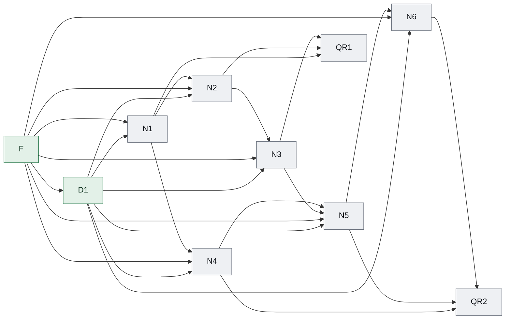

### Dependency edge table

| From | To | Dependency type | Dependency scope | Required upstream state | Assumption IDs | Invalidation keys | Transferred input | Gate/evidence |
|---|---|---|---|---|---|---|---|---|
| D1 | N1 | hard | specific-output | ACCEPTED | none | codex-migration.documentation-scope.v1 | 用户确认编制本地旧对话迁移工具与站内经验下载衔接的开发 SSOT，仅确认文档范围。 | acceptance contract evidence |
| D1 | N2 | hard | specific-output | ACCEPTED | none | codex-migration.documentation-scope.v1 | 用户确认编制本地旧对话迁移工具与站内经验下载衔接的开发 SSOT，仅确认文档范围。 | acceptance contract evidence |
| D1 | N3 | hard | specific-output | ACCEPTED | none | codex-migration.documentation-scope.v1 | 用户确认编制本地旧对话迁移工具与站内经验下载衔接的开发 SSOT，仅确认文档范围。 | acceptance contract evidence |
| D1 | N4 | hard | specific-output | ACCEPTED | none | codex-migration.documentation-scope.v1 | 用户确认编制本地旧对话迁移工具与站内经验下载衔接的开发 SSOT，仅确认文档范围。 | acceptance contract evidence |
| D1 | N5 | hard | specific-output | ACCEPTED | none | codex-migration.documentation-scope.v1 | 用户确认编制本地旧对话迁移工具与站内经验下载衔接的开发 SSOT，仅确认文档范围。 | acceptance contract evidence |
| D1 | N6 | hard | specific-output | ACCEPTED | none | codex-migration.documentation-scope.v1 | 用户确认编制本地旧对话迁移工具与站内经验下载衔接的开发 SSOT，仅确认文档范围。 | acceptance contract evidence |
| F | D1 | hard | specific-output | ACCEPTED | none | source.identity | 建立来源身份基线 | acceptance contract evidence |
| F | N1 | hard | specific-output | ACCEPTED | none | source.identity | 建立来源身份基线 | acceptance contract evidence |
| F | N2 | hard | specific-output | ACCEPTED | none | source.identity | 建立来源身份基线 | acceptance contract evidence |
| F | N3 | hard | specific-output | ACCEPTED | none | source.identity | 建立来源身份基线 | acceptance contract evidence |
| F | N4 | hard | specific-output | ACCEPTED | none | source.identity | 建立来源身份基线 | acceptance contract evidence |
| F | N5 | hard | specific-output | ACCEPTED | none | source.identity | 建立来源身份基线 | acceptance contract evidence |
| F | N6 | hard | specific-output | ACCEPTED | none | source.identity | 建立来源身份基线 | acceptance contract evidence |
| N1 | N2 | hard | specific-output | ACCEPTED | none | requirement.n1 | 识别实际客户端数据根、目标接入配置及需要迁移的旧任务，生成只读可审阅计划。 | acceptance contract evidence |
| N1 | N4 | hard | specific-output | ACCEPTED | none | requirement.n1 | 识别实际客户端数据根、目标接入配置及需要迁移的旧任务，生成只读可审阅计划。 | acceptance contract evidence |
| N1 | QR1 | hard | specific-output | ACCEPTED | none | requirement.n1 | 识别实际客户端数据根、目标接入配置及需要迁移的旧任务，生成只读可审阅计划。 | acceptance contract evidence |
| N2 | N3 | hard | specific-output | ACCEPTED | none | requirement.n2 | 实现先备份再写入的迁移事务、崩溃恢复、精准回滚及内容守恒验证。 | acceptance contract evidence |
| N2 | QR1 | hard | specific-output | ACCEPTED | none | requirement.n2 | 实现先备份再写入的迁移事务、崩溃恢复、精准回滚及内容守恒验证。 | acceptance contract evidence |
| N3 | N5 | hard | specific-output | ACCEPTED | none | requirement.n3 | 交付同一核心的跨平台命令行、离线工具包、机器可读报告和真实客户端接续验证。 | acceptance contract evidence |
| N3 | QR1 | hard | specific-output | ACCEPTED | none | requirement.n3 | 交付同一核心的跨平台命令行、离线工具包、机器可读报告和真实客户端接续验证。 | acceptance contract evidence |
| N4 | N5 | hard | specific-output | ACCEPTED | none | requirement.n4 | 新增面向普通使用者的完整迁移案例和自包含 Codex 处理指令。 | acceptance contract evidence |
| N4 | QR2 | hard | specific-output | ACCEPTED | none | requirement.n4 | 新增面向普通使用者的完整迁移案例和自包含 Codex 处理指令。 | acceptance contract evidence |
| N5 | N6 | hard | specific-output | ACCEPTED | none | requirement.n5 | 让 P1 接入说明、经验详情、预渲染和下载清单消费同一目标配置及发布内容。 | acceptance contract evidence |
| N5 | QR2 | hard | specific-output | ACCEPTED | none | requirement.n5 | 让 P1 接入说明、经验详情、预渲染和下载清单消费同一目标配置及发布内容。 | acceptance contract evidence |
| N6 | QR2 | hard | specific-output | ACCEPTED | none | requirement.n6 | 补齐嵌入分发验证、公开站点交付检查和独立用户验收材料。 | acceptance contract evidence |

### ASCII topology graph

```text
Layer 0: F
Layer 1: D1
Layer 2: N1
Layer 3: N2, N4
Layer 4: N3
Layer 5: N5, QR1
Layer 6: N6
Layer 7: QR2
Edges:
  D1 -> N1
  D1 -> N2
  D1 -> N3
  D1 -> N4
  D1 -> N5
  D1 -> N6
  F -> D1
  F -> N1
  F -> N2
  F -> N3
  F -> N4
  F -> N5
  F -> N6
  N1 -> N2
  N1 -> N4
  N1 -> QR1
  N2 -> N3
  N2 -> QR1
  N3 -> N5
  N3 -> QR1
  N4 -> N5
  N4 -> QR2
  N5 -> N6
  N5 -> QR2
  N6 -> QR2
```

### Dependency graph (mermaid)



### State ledger

| Task ID | Stage | State |
|---|---|---|
| D1 | R1 | ACCEPTED |
| F | R1 | ACCEPTED |
| N1 | R1 | PLANNED |
| N2 | R1 | PLANNED |
| N3 | R1 | PLANNED |
| N4 | R2 | PLANNED |
| N5 | R2 | PLANNED |
| N6 | R2 | PLANNED |
| QR1 | R1 | PLANNED |
| QR2 | R2 | PLANNED |

### Semantic node registry

| Task ID | Semantic key | Execution state |
|---|---|---|
| D1 | codex-migration.documentation-scope | ACCEPTED |
| F | source.identity-baseline | ACCEPTED |
| N1 | requirement.n1 | PLANNED |
| N2 | requirement.n2 | PLANNED |
| N3 | requirement.n3 | PLANNED |
| N4 | requirement.n4 | PLANNED |
| N5 | requirement.n5 | PLANNED |
| N6 | requirement.n6 | PLANNED |
| QR1 | acceptance.release.r1 | PLANNED |
| QR2 | acceptance.release.r2 | PLANNED |

### Ready frontier

| Task ID | Eligibility |
|---|---|
| D1 | not-ready |
| F | not-ready |
| N1 | not-ready |
| N2 | not-ready |
| N3 | not-ready |
| N4 | not-ready |
| N5 | not-ready |
| N6 | not-ready |
| QR1 | not-ready |
| QR2 | not-ready |
