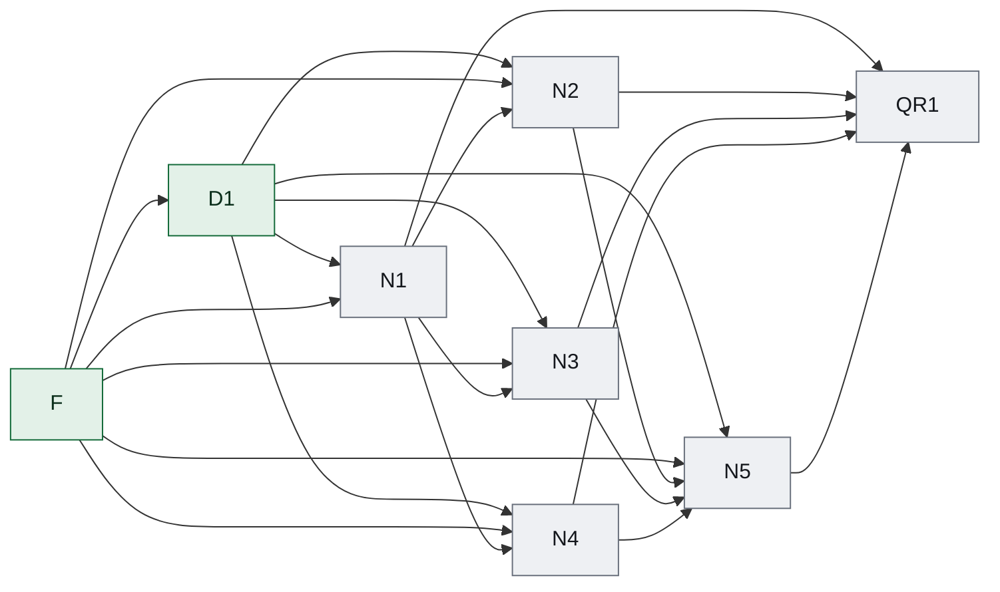

### Dependency edge table

| From | To | Dependency type | Dependency scope | Required upstream state | Assumption IDs | Invalidation keys | Transferred input | Gate/evidence |
|---|---|---|---|---|---|---|---|---|
| D1 | N1 | hard | specific-output | ACCEPTED | none | rest2build.experience-center.local-hmr-scope.v1 | 用户确认针对经验中心、主题统一、中文文案和深色导航编制 SSOT，并限定本轮只做本地 HMR，不同步生产端。 | acceptance contract evidence |
| D1 | N2 | hard | specific-output | ACCEPTED | none | rest2build.experience-center.local-hmr-scope.v1 | 用户确认针对经验中心、主题统一、中文文案和深色导航编制 SSOT，并限定本轮只做本地 HMR，不同步生产端。 | acceptance contract evidence |
| D1 | N3 | hard | specific-output | ACCEPTED | none | rest2build.experience-center.local-hmr-scope.v1 | 用户确认针对经验中心、主题统一、中文文案和深色导航编制 SSOT，并限定本轮只做本地 HMR，不同步生产端。 | acceptance contract evidence |
| D1 | N4 | hard | specific-output | ACCEPTED | none | rest2build.experience-center.local-hmr-scope.v1 | 用户确认针对经验中心、主题统一、中文文案和深色导航编制 SSOT，并限定本轮只做本地 HMR，不同步生产端。 | acceptance contract evidence |
| D1 | N5 | hard | specific-output | ACCEPTED | none | rest2build.experience-center.local-hmr-scope.v1 | 用户确认针对经验中心、主题统一、中文文案和深色导航编制 SSOT，并限定本轮只做本地 HMR，不同步生产端。 | acceptance contract evidence |
| F | D1 | hard | specific-output | ACCEPTED | none | source.identity | 建立来源身份基线 | acceptance contract evidence |
| F | N1 | hard | specific-output | ACCEPTED | none | source.identity | 建立来源身份基线 | acceptance contract evidence |
| F | N2 | hard | specific-output | ACCEPTED | none | source.identity | 建立来源身份基线 | acceptance contract evidence |
| F | N3 | hard | specific-output | ACCEPTED | none | source.identity | 建立来源身份基线 | acceptance contract evidence |
| F | N4 | hard | specific-output | ACCEPTED | none | source.identity | 建立来源身份基线 | acceptance contract evidence |
| F | N5 | hard | specific-output | ACCEPTED | none | source.identity | 建立来源身份基线 | acceptance contract evidence |
| N1 | N2 | hard | specific-output | ACCEPTED | none | requirement.n1 | 定义经验中心的主题目录、P1 到主题的上下文入口以及主题到具体经验的双向导航合同。 | acceptance contract evidence |
| N1 | N3 | hard | specific-output | ACCEPTED | none | requirement.n1 | 定义经验中心的主题目录、P1 到主题的上下文入口以及主题到具体经验的双向导航合同。 | acceptance contract evidence |
| N1 | N4 | hard | specific-output | ACCEPTED | none | requirement.n1 | 定义经验中心的主题目录、P1 到主题的上下文入口以及主题到具体经验的双向导航合同。 | acceptance contract evidence |
| N1 | QR1 | hard | specific-output | ACCEPTED | none | requirement.n1 | 定义经验中心的主题目录、P1 到主题的上下文入口以及主题到具体经验的双向导航合同。 | acceptance contract evidence |
| N2 | N5 | hard | specific-output | ACCEPTED | none | requirement.n2 | 将经验列表实现为高信息密度的响应式卡片网格，使主题、摘要、适用对象和行动入口可扫描。 | acceptance contract evidence |
| N2 | QR1 | hard | specific-output | ACCEPTED | none | requirement.n2 | 将经验列表实现为高信息密度的响应式卡片网格，使主题、摘要、适用对象和行动入口可扫描。 | acceptance contract evidence |
| N3 | N5 | hard | specific-output | ACCEPTED | none | requirement.n3 | 以首页 P3 的成熟风格统一公共页面和首页经验模块，并将中文首页定位改为经验分享导向。 | acceptance contract evidence |
| N3 | QR1 | hard | specific-output | ACCEPTED | none | requirement.n3 | 以首页 P3 的成熟风格统一公共页面和首页经验模块，并将中文首页定位改为经验分享导向。 | acceptance contract evidence |
| N4 | N5 | hard | specific-output | ACCEPTED | none | requirement.n4 | 修复公共导航与 P3 顶部标签在深浅主题和不同宽度下的全宽布局、对齐与对比度。 | acceptance contract evidence |
| N4 | QR1 | hard | specific-output | ACCEPTED | none | requirement.n4 | 修复公共导航与 P3 顶部标签在深浅主题和不同宽度下的全宽布局、对齐与对比度。 | acceptance contract evidence |
| N5 | QR1 | hard | specific-output | ACCEPTED | none | requirement.n5 | 建立主题、文案和视觉的自动回归检查，并完成只读本地 HMR 的桌面与移动验收记录。 | acceptance contract evidence |

### ASCII topology graph

```text
Layer 0: F
Layer 1: D1
Layer 2: N1
Layer 3: N2, N3, N4
Layer 4: N5
Layer 5: QR1
Edges:
  D1 -> N1
  D1 -> N2
  D1 -> N3
  D1 -> N4
  D1 -> N5
  F -> D1
  F -> N1
  F -> N2
  F -> N3
  F -> N4
  F -> N5
  N1 -> N2
  N1 -> N3
  N1 -> N4
  N1 -> QR1
  N2 -> N5
  N2 -> QR1
  N3 -> N5
  N3 -> QR1
  N4 -> N5
  N4 -> QR1
  N5 -> QR1
```

### Dependency graph (mermaid)



### State ledger

| Task ID | Stage | State |
|---|---|---|
| D1 | R1 | ACCEPTED |
| F | R1 | ACCEPTED |
| N1 | R1 | PLANNED |
| N2 | R1 | PLANNED |
| N3 | R1 | PLANNED |
| N4 | R1 | PLANNED |
| N5 | R1 | PLANNED |
| QR1 | R1 | PLANNED |

### Semantic node registry

| Task ID | Semantic key | Execution state |
|---|---|---|
| D1 | rest2build.experience-center.local-hmr-scope | ACCEPTED |
| F | source.identity-baseline | ACCEPTED |
| N1 | requirement.n1 | PLANNED |
| N2 | requirement.n2 | PLANNED |
| N3 | requirement.n3 | PLANNED |
| N4 | requirement.n4 | PLANNED |
| N5 | requirement.n5 | PLANNED |
| QR1 | acceptance.release.r1 | PLANNED |

### Ready frontier

| Task ID | Eligibility |
|---|---|
| D1 | not-ready |
| F | not-ready |
| N1 | not-ready |
| N2 | not-ready |
| N3 | not-ready |
| N4 | not-ready |
| N5 | not-ready |
| QR1 | not-ready |
