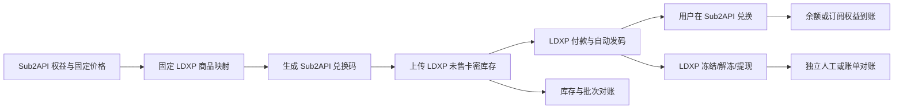

# LDXP 销售渠道接入开发文档

## 1. 文档目的

本文定义链动小铺（LDXP）接入 Sub2API 的首期开发边界、数据契约、运行流程、管理接口和生产门禁。

首期把 LDXP 定义为“外部销售渠道 + 卡密交付平台”，不把它注册为 Sub2API 原生支付 provider。Sub2API 继续维护唯一的余额和订阅权益账本；LDXP 负责商品展示、付款、发码和外部结算。

公开页面观察到的 `getUserChannel → getGoodsPrice → Pay/order → Pay/query` 只能用于理解链路。它没有证明服务端商户 API、签名回调、退款、关闭单或日结对账契约，因此不能直接作为生产收款适配器。

## 2. 边界与不变量

### 2.1 首期允许的链路



必须保持以下不变量：

1. LDXP 商品只能映射到固定的 Sub2API 权益，不允许把 LDXP 动态报价直接写入余额或订阅账本。
2. 每个商品映射包含唯一 `goods_id`、固定面额或计划、映射版本和启用状态；映射改变时创建新版本，不覆盖已上传批次。
3. 兑换码由 Sub2API 生成并保存，兑换由 Sub2API 幂等处理；LDXP 不拥有权益状态。
4. LDXP 的冻结、T+1 解冻、提现和争议不改变 Sub2API 的订单或履约状态。
5. LDXP 故障只能阻止补货或销售渠道启用，不能污染官方支付宝、微信、Stripe 等其他 provider。

### 2.2 明确禁止

- 在用户支付按钮中直接请求 LDXP `/shopApi/*`。
- 把 `Platform`、`Zhifutong`、`Shoufutong`、`Custom` 暴露为 Sub2API 用户支付类型。
- 使用浏览器 `Merchant-Token`、前端轮询或支付结果页作为服务端收款证据。
- 在没有官方服务端 API 和签名回调前新增 `ldxp` 原生支付 provider。
- 用现有 `payment_orders.status` 表达 LDXP 冻结、解冻、结算或提现。

## 3. 当前源码基线

| 能力 | 当前位置 | 当前状态 |
| --- | --- | --- |
| 固定金额支付订单、权益履约 | `backend/internal/service/payment_order.go`、`payment_fulfillment.go` | 已有，继续服务原生收银台 |
| Provider 实例和订单 snapshot | `backend/ent/schema/payment_order.go`、`backend/internal/payment` | 已有，不用于 LDXP 销售渠道订单 |
| 生成确定性 LDXP 兑换码、查询未售库存、上传卡密 | `backend/internal/service/liandong_restock_service.go` | 已有服务和单测 |
| LDXP 配置加密存储 | `LiandongRestockService.UpdateConfiguration` | 已有，Merchant Token 不明文保存 |
| LDXP 兑换与 x-ui 履约边界 | `services/xui-sales/README.md` | 已有文档和独立服务 |
| LDXP 服务的 Wire 注入、管理路由、运行时清理 | `backend/internal/service/wire.go`、`backend/internal/handler`、`backend/internal/server/routes` | 已接入；通过管理员 API 控制 |
| LDXP 商品到订阅计划的完整映射 | `RedeemCode` 支持 `group_id/validity_days`，但首期补货服务只接受余额商品 | 原生订阅映射待后续版本 |

## 4. 第一阶段实现计划：销售渠道库存服务

### 4.1 商品映射模型

建议把现有 `LiandongRestockProduct` 扩展为固定映射记录：

```json
{
  "version": 1,
  "goods_id": 12345,
  "cny_amount": 20,
  "grant_type": "balance",
  "usd_credit": 2.78,
  "group_id": null,
  "validity_days": null,
  "threshold": 20,
  "restock_count": 50,
  "enabled": true
}
```

当前实现使用字段 `grant_type`；首期只允许：

- `balance`：要求 `usd_credit > 0`。

`subscription` 字段保留在持久化模型中用于后续扩展，但首期配置会拒绝该类型，不能把它当作已上线能力。

补货批次必须固化映射快照，至少保存 `batch_id`、`goods_id`、`mapping_version`、权益类型、权益值、生成数量和创建时间。重试同一批次时必须生成完全相同的兑换码集合。

### 4.2 补货状态机

```text
CHECKING
  -> STOCK_OK
  -> BATCH_RESERVED
  -> CODES_CREATED
  -> UPLOADED
  -> RECONCILED

BATCH_RESERVED/CODES_CREATED/UPLOADED 失败
  -> PENDING_RETRY
  -> 使用同一 batch_id 重试
```

具体规则：

1. 查询 LDXP 未售库存低于阈值后，先持久化 pending batch，再生成兑换码。
2. 本地兑换码已存在时，必须逐字段核对权益类型、金额、分组和有效期；不一致立即失败。
3. 上传失败保留 pending batch，不创建第二批码。
4. 上传成功后再清除 pending batch，并保存本地库存快照。
5. LDXP 返回异常、结构不完整或 HTTP 非 2xx 时，状态进入错误并保留可重试证据。

### 4.3 运行时接入

需要完成：

- 将 `ProvideLiandongRestockService` 加入 `backend/internal/service/wire.go` 的 ProviderSet。
- 在服务生命周期结束时调用 `StopWorker()`（当前 worker 由 Wire 创建并随进程退出停止）。
- 为未配置、配置不完整和 API 不可达分别返回可读状态，不自动启用销售渠道。
- 后台状态中明确返回：

```json
{
  "integration_mode": "sales_channel",
  "payment_readiness": "NOT_READY",
  "configured": false,
  "enabled": false,
  "pending_batch": false
}
```

`payment_readiness=NOT_READY` 是原生支付聚合门禁，不代表已配置的库存补货任务不能在测试环境运行。

## 5. 管理 API 设计

当前已实现接口统一挂在管理员认证、审计和合规门禁之后：

| 方法 | 路径 | 用途 |
| --- | --- | --- |
| `GET` | `/api/v1/admin/liandong/restock/status` | 查看脱敏配置、运行、库存、pending batch 和最近批次 |
| `PUT` | `/api/v1/admin/liandong/restock/config` | 更新加密凭证和固定商品映射 |
| `PUT` | `/api/v1/admin/liandong/restock/policies` | 更新阈值、补货数量和商品启用状态 |
| `POST` | `/api/v1/admin/liandong/restock/run` | 手动执行一次补货检查，遵守 pending batch 幂等 |
| `POST` | `/api/v1/admin/liandong/restock/enable` | 启用或停用自动补货，body 为 `{\"enabled\":true/false}` |

安全要求：

- 响应只返回 `merchant_token_configured`、`code_secret_configured`，不返回凭证。
- 配置变更前必须停止任务，且不能存在 pending batch。
- 所有写操作使用现有管理审计和幂等机制。
- `enable` 只能启用库存服务，不得改变原生支付 provider 的可用性。

## 6. 兑换和履约

### 6.1 余额商品

生成 `RedeemTypeBalance`，`Value` 固定为映射中的 `usd_credit`。用户兑换后由 Sub2API 余额账本入账。

### 6.2 订阅商品（后续版本）

`RedeemTypeSubscription`、`GroupID` 和 `ValidityDays` 已有底层兑换能力，但当前 Liandong 补货配置会拒绝 `subscription`。只有完成字段扩展、批次快照和独立测试后，才能开放该类型。

两类商品都必须满足兑换幂等：同一个兑换码只能成功使用一次，重复请求返回已使用状态，不能再次增加余额或延长订阅。

## 7. 对账与结算边界

第一阶段只保存以下本地事实：

- 商品映射版本；
- 生成批次和兑换码数量；
- LDXP 未售库存快照；
- 上传结果、失败原因和重试次数；
- 兑换结果和 Sub2API 权益变化。

LDXP 的销售金额、手续费、冻结、解冻和提现需要独立的 settlement read model 或外部账单导入，不得写入 `PaymentOrder.status`。正式结算对象至少包含：账单、账单行、总额、手续费、净额、外部流水号、对账状态和差异原因。

## 8. 第二阶段：原生支付聚合的进入条件

只有以下证据全部具备，才允许新增 `ldxp` provider 或把它作为兼容的 `easypay` 实例接入：

1. 官方商户服务端建单 API，支持服务端认证和幂等键。
2. 官方签名回调规范，能验证商户、店铺、渠道、金额、币种和订单号。
3. 服务端主动查单、关闭单、退款、退款查询和争议处理协议。
4. `trade_no`、渠道原始流水号和商户订单号的稳定映射。
5. 日结账单或对账 API，能逐笔核对总额、手续费和净额。
6. 沙箱或测试环境完成重复回调、回调丢失、金额篡改、退款和超时测试。

满足条件后再实现：

```text
Sub2API PaymentOrder(PENDING)
  -> 固定 provider_instance_id
  -> LDXP 创建固定金额订单
  -> 保存 pay_url/二维码/upstream_trade_no
  -> 回调或主动查询
  -> 校验签名、金额、币种、店铺和渠道
  -> PAID
  -> RECHARGING
  -> COMPLETED
```

上游订单已创建后禁止静默切换到其他实例。路由候选集必须精确到 `provider_instance_id`，不能只按 `provider_key` 混合负载均衡。

## 9. 验收矩阵

### 第一阶段必须通过

- 商品映射重复的 `cny_amount` 或 `goods_id` 被拒绝。
- 余额商品缺少正数 `usd_credit` 被拒绝。
- 显式提交 `subscription` 商品被拒绝（首期只允许余额商品）。
- 同一 pending batch 重试不会生成重复兑换码。
- LDXP 上传失败会保留 pending batch，并在重试时上传相同内容。
- 本地兑换码权益字段不一致时拒绝继续上传。
- 重复兑换不能重复入账或延长订阅。
- 未配置、凭证缺失或库存 API 不可达时状态可见且不会自动启用销售渠道。
- `payment_readiness` 始终为 `NOT_READY`，不会出现在原生支付宝/微信支付方式列表。
- `make test-xui-sales` 和相关 Go 单测通过。

### 第二阶段才验收

- 原生 LDXP 建单、查询、回调签名、金额校验、幂等、退款和对账全链路。
- 正式 provider 的故障隔离、实例固定、主动查询补偿和生产回滚。

## 10. 人工验收文档

人工执行步骤、证据格式、首期卡密渠道验收、LDXP 原生支付沙箱测试和放行签字要求，单独维护在 [LDXP_SALES_CHANNEL_HUMAN_ACCEPTANCE.md](LDXP_SALES_CHANNEL_HUMAN_ACCEPTANCE.md)。

开发文档只定义实现边界和自动化验收条件；没有人工验收记录时，不得把渠道标记为生产已验收。

## 11. 发布门禁

生产发布前必须同时提供：

- 固定商品映射版本和本地/LDXP 库存数量对齐记录；
- 一次明确批准的测试兑换及其权益到账记录；
- 重复补货和重复兑换的测试日志；
- LDXP 未售库存、本地生成批次和兑换结果的差异报告；
- 若声称已完成支付聚合，还必须附官方 API、签名回调和结算对账证据。

在官方服务端契约缺失时，发布状态只能写为“LDXP 卡密销售渠道可选，原生支付聚合 NOT_READY”，不能写成“LDXP 支付 provider 已完成”。
