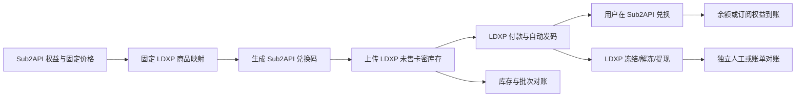

# LDXP 销售渠道与管理员工具开发文档

## 1. 文档目的

本文定义链动小铺（LDXP）接入 Sub2API 的首期开发边界、数据契约、运行流程、管理员工具、独立 CLI 和生产门禁。

首期把 LDXP 定义为“外部销售渠道 + 卡密交付平台”，不把它注册为 Sub2API 原生支付 provider。Sub2API 继续维护唯一的余额和订阅权益账本；LDXP 负责商品展示、付款、发码和外部结算。

公开页面观察到的 `getUserChannel → getGoodsPrice → Pay/order → Pay/query` 只能用于理解链路。它没有证明服务端商户 API、签名回调、退款、关闭单或日结对账契约，因此不能直接作为生产收款适配器。

## 2. 边界与不变量

### 2.1 首期允许的链路



必须保持以下不变量：

1. LDXP 商品只能映射到固定的 Sub2API 权益，不允许把 LDXP 动态报价直接写入余额或订阅账本。
2. 每个商品映射包含唯一 `goods_id`、固定面额或计划、映射版本和启用状态；映射改变时创建新版本，不覆盖已上传批次。
3. 兑换码由 Sub2API 生成并保存，兑换由 Sub2API 幂等处理；LDXP 不拥有权益状态。
4. LDXP 的冻结、T+1 解冻、提现和争议不改变 Sub2API 的订单或履约状态。
5. LDXP 故障只能阻止补货或销售渠道启用，不能污染官方支付宝、微信、Stripe 等其他 provider。

### 2.2 明确禁止

- 在用户支付按钮中直接请求 LDXP `/shopApi/*`。
- 把 `Platform`、`Zhifutong`、`Shoufutong`、`Custom` 暴露为 Sub2API 用户支付类型。
- 使用浏览器 `Merchant-Token`、前端轮询或支付结果页作为服务端收款证据。
- 在没有官方服务端 API 和签名回调前新增 `ldxp` 原生支付 provider。
- 用现有 `payment_orders.status` 表达 LDXP 冻结、解冻、结算或提现。

## 3. 当前源码基线

| 能力 | 当前位置 | 当前状态 |
| --- | --- | --- |
| 固定金额支付订单、权益履约 | `backend/internal/service/payment_order.go`、`payment_fulfillment.go` | 已有，继续服务原生收银台 |
| Provider 实例和订单 snapshot | `backend/ent/schema/payment_order.go`、`backend/internal/payment` | 已有，不用于 LDXP 销售渠道订单 |
| 生成确定性 LDXP 兑换码、查询未售库存、分段上传卡密 | `backend/internal/service/liandong_restock_core.go`、`liandong_restock_service.go` | 已实现；每批最多 1,000 条，20 位码同时含数字、小写和大写英文 |
| LDXP 配置加密存储和商品映射版本 | `LiandongRestockService.UpdateConfiguration` | 已实现；Merchant Token 不明文返回，未映射或非余额商品不可补货 |
| LDXP 兑换与 x-ui 履约边界 | `services/xui-sales/README.md` | 已有文档和独立服务 |
| LDXP 服务的 Wire 注入、管理路由、运行时清理 | `backend/cmd/server/wire.go`、`backend/internal/handler`、`backend/internal/server/routes` | 已接入；服务关闭时停止补货 worker |
| 管理员工具页面 | `frontend/src/views/admin/LiandongToolkitView.vue` | 已实现，路径为 `/admin/tools/ldxp` |
| 支付设置中的销售渠道入口 | `frontend/src/views/admin/SettingsView.vue` | 已实现；明确链动小铺不属于支付服务商，支付总开关关闭时仍可进入 `/admin/tools/ldxp`，支付页不再显示 GitHub 支付文档跳转 |
| 独立 CLI | `tools/ldxp-toolkit` | 已实现，运行时不依赖 Node、Python 或浏览器 |
| 固定工具安装包校验 | `backend/internal/service/liandong_tool_runtime.go` | 已实现；本地固定资产必须匹配服务端配置的 SHA-256 才可安装 |
| LDXP 商品到订阅计划的完整映射 | `RedeemCode` 支持 `group_id/validity_days`，但首期补货服务只接受余额商品 | 原生订阅映射待后续版本 |

支付设置页的桌面、移动布局和链动销售渠道入口维护在 [Sub2api 可编辑 Figma 设计](https://www.figma.com/design/bG5roZJVC4F4IQwaL8oeOk)。前端源码仍是运行行为的唯一权威；Figma 文件用于界面评审和响应式对照。

## 4. 第一阶段实现计划：销售渠道库存服务

### 4.1 商品映射模型

当前 `LiandongRestockProduct` 是按 `goods_id` 固定的版本化映射；商品名称只用于管理员识别，绝不用于推断余额额度或权益类型：

```json
{
  "version": 1,
  "goods_id": 12345,
  "cny_amount": 20,
  "grant_type": "balance",
  "usd_credit": 2.78,
  "target_stock": 50000,
  "enabled": true
}
```

可选的 `external_url` 仅作为公开商品参考地址。它必须是无用户信息、无查询字符串、无片段的公共 HTTP(S) URL，不能作为凭证或接口地址。

当前实现使用字段 `grant_type`；首期只允许：

- `balance`：要求 `usd_credit > 0`。

`subscription` 字段保留在持久化模型中用于后续扩展，但首期配置会拒绝该类型，不能把它当作已上线能力。

补货批次在创建兑换码和上传前固化映射快照，至少保存 `batch_id`、`goods_id`、`mapping_version`、权益类型、权益值、目标库存、库存基线、生成数量和创建时间。一个批次所派生的卡密集合是确定的：安全随机配置密钥只在创建配置时生成，同一批次重试始终复用相同卡密集合，不能另建一组替代卡密。

映射修改只影响之后创建的批次。存在未完成任务、失败任务或待核对结果时，系统拒绝用新映射覆盖该任务的输入。订阅映射仍不在首期补货范围内。

### 4.2 补货状态机

下图是一次任务的处理阶段；持久化任务状态为 `queued`、`running`、`completed`、`failed` 或 `needs_reconciliation`，批次和分段状态单独记录：

```text
CHECKING
  -> PLANNED: max(0, target_stock - current_unsold_stock)
  -> PENDING_BATCH
  -> CODES_CREATED
  -> SEGMENTS_UPLOADED
  -> UPLOADED

可确认未写入远端的失败
  -> FAILED
  -> 以原 batch_id 和原卡密集合恢复

远端写入结果不明
  -> NEEDS_RECONCILIATION
  -> 只能人工技术核对，禁止自动恢复或重传
```

具体规则：

1. 任务固定读取 `is_proxy=0` 商品的未售库存，并按 `新增量 = max(0, target_stock - current_unsold_stock)` 计算缺口。默认目标是 50,000；库存为 12,000 时计划新增 38,000。任务只使用其库存基线，不会在销售发生时持续追补。
2. 提交前先持久化批次、映射快照和分段计划，再创建兑换码；每段最多 1,000 条。`preview` 是只读操作，既不生成兑换码，也不修改远端库存。
3. 本地兑换码已存在时，必须逐字段核对权益类型、余额额度和批次关联；不一致立即失败。已确认上传的分段绝不再次提交。
4. 可确认未发生远端写入的本地失败可恢复，恢复仍使用同一批次和同一组卡密，不能创建第二批卡密。
5. 连接中断、超时、响应结构异常、HTTP 非 2xx、应用层拒绝，以及本地无法持久化远端确认，均按远端写入结果不明处理，进入 `needs_reconciliation`。库存变化只能作为辅助证据，不能单独证明一个分段内的全部卡密已上传。
6. `needs_reconciliation` 是锁存停止状态，管理员页面、CLI 和自动任务都不能盲目重试或恢复；必须先完成受控的技术核对并更新可追溯证据。

### 4.3 运行时接入

当前运行时已完成以下接入：

- `backend/cmd/server/wire.go` 创建服务，并在进程关闭时停止补货 worker。
- 管理员页面为 `/admin/tools/ldxp`；它显示工具安装状态、脱敏配置、映射、商品、预览和持久化任务进度。
- 支付设置页单独显示“链动小铺销售渠道”入口，并明确它不是支付服务商；该入口不受原生支付总开关控制，只导航到固定的管理员工具页面。
- 固定工具资产只能从服务端配置的本地文件安装。运行时校验操作系统、架构、文件完整性、执行权限、数据目录可写性和 SHA-256；安装与修复不下载 URL、不运行网页提交的命令。
- 配置、凭证缺失或商户接口不可达分别提供可读状态，且不会自动启用销售渠道。

后台状态包含：

```json
{
  "integration_mode": "sales_channel",
  "payment_readiness": "NOT_READY",
  "configured": false,
  "enabled": false,
  "pending_batch": false
}
```

`payment_readiness=NOT_READY` 是原生支付聚合门禁，不代表已配置的库存补货任务不能在测试环境运行。

### 4.4 独立 CLI

`tools/ldxp-toolkit` 可独立运行，不依赖 Node、Python 或浏览器。它必须显式传入受保护的配置文件，所有任务请求仍经管理员工具 API 执行；CLI 不把链动商户凭证复制到作业请求中。

```text
ldxp-toolkit --config /secure/path/ldxp.json doctor
ldxp-toolkit --config /secure/path/ldxp.json goods list
ldxp-toolkit --config /secure/path/ldxp.json config validate
ldxp-toolkit --config /secure/path/ldxp.json restock preview
ldxp-toolkit --config /secure/path/ldxp.json restock run
ldxp-toolkit --config /secure/path/ldxp.json jobs status --id JOB_ID
ldxp-toolkit --config /secure/path/ldxp.json jobs resume --id JOB_ID
ldxp-toolkit --config /secure/path/ldxp.json export --id JOB_ID
```

`doctor` 检查配置和私有数据目录权限；`preview` 仅计算和核验计划；`run` 创建持久化后台任务；`export` 仅导出所有分段均已确认上传的完成任务。CLI 输出会脱敏凭证和卡密内容，导出文件写入受保护的数据目录。

## 5. 管理 API 设计

当前已实现接口以 `/api/v1/admin/tools/ldxp` 为根路径，统一经过管理员认证、审计、专用 LDXP 限流和合规门禁：

| 方法 | 路径 | 用途 |
| --- | --- | --- |
| `GET` | `/installation` | 读取操作系统、架构、安装路径、权限和校验状态；不执行工具 |
| `POST` | `/installation` | 从已配置的固定本地资产原子安装或修复工具 |
| `GET` | `/status` | 读取脱敏配置、作业、批次和运行状态 |
| `PUT` | `/config` | 更新加密商户配置和固定商品映射 |
| `POST` | `/config/test` | 使用已持久化配置执行只读商户连通性测试 |
| `GET` | `/goods` | 固定读取非代理商品，即 `is_proxy=0` |
| `POST` | `/jobs/preview` | 计算只读补货计划 |
| `POST` | `/jobs/run` | 创建持久化手动任务，返回 `202 Accepted` |
| `GET` | `/jobs/:id` | 读取不含卡密的安全任务摘要 |
| `POST` | `/jobs/:id/resume` | 仅恢复可确认安全失败的任务 |
| `GET` | `/jobs/:id/export` | 流式导出符合导出条件的完成任务附件 |

安全要求：

- 响应和普通审计记录只返回 `merchant_token_configured`、`code_secret_configured` 等配置状态，不返回商户凭证、完整卡密、卡密派生密钥摘要、带凭证 URL 或商户响应正文。
- 映射变更不能改变开放任务、失败任务或待核对任务的执行输入。
- 专用 LDXP 限流不接受普通管理员豁免。安装、配置、运行、恢复和导出操作在限流后端不可用时失败关闭；只读状态和预览才允许降级读取。
- 后端只调用固定安装位置的工具及白名单子命令，通过受保护通道传递短期任务凭证；网页请求不能传入任意 Shell 命令、文件路径、URL 或归档包。
- 自动补货仍是手动真实链路验收之后的独立运营决策，默认不作为本期生产能力启用；它不会改变原生支付 provider 的可用性。

## 6. 兑换和履约

### 6.1 余额商品

生成 `RedeemTypeBalance`，`Value` 固定为映射中的 `usd_credit`。用户兑换后由 Sub2API 余额账本入账。

### 6.2 订阅商品（后续版本）

`RedeemTypeSubscription`、`GroupID` 和 `ValidityDays` 已有底层兑换能力，但当前 Liandong 补货配置会拒绝 `subscription`。只有完成字段扩展、批次快照和独立测试后，才能开放该类型。

两类商品都必须满足兑换幂等：同一个兑换码只能成功使用一次，重复请求返回已使用状态，不能再次增加余额或延长订阅。

## 7. 对账与结算边界

第一阶段只保存以下本地事实：

- 商品映射版本；
- 生成批次和兑换码数量；
- LDXP 未售库存快照；
- 上传结果、失败原因和重试次数；
- 兑换结果和 Sub2API 权益变化。

LDXP 的销售金额、手续费、冻结、解冻和提现需要独立的 settlement read model 或外部账单导入，不得写入 `PaymentOrder.status`。正式结算对象至少包含：账单、账单行、总额、手续费、净额、外部流水号、对账状态和差异原因。

## 8. 第二阶段：原生支付聚合的进入条件

只有以下证据全部具备，才允许新增 `ldxp` provider 或把它作为兼容的 `easypay` 实例接入：

1. 官方商户服务端建单 API，支持服务端认证和幂等键。
2. 官方签名回调规范，能验证商户、店铺、渠道、金额、币种和订单号。
3. 服务端主动查单、关闭单、退款、退款查询和争议处理协议。
4. `trade_no`、渠道原始流水号和商户订单号的稳定映射。
5. 日结账单或对账 API，能逐笔核对总额、手续费和净额。
6. 沙箱或测试环境完成重复回调、回调丢失、金额篡改、退款和超时测试。

满足条件后再实现：

```text
Sub2API PaymentOrder(PENDING)
  -> 固定 provider_instance_id
  -> LDXP 创建固定金额订单
  -> 保存 pay_url/二维码/upstream_trade_no
  -> 回调或主动查询
  -> 校验签名、金额、币种、店铺和渠道
  -> PAID
  -> RECHARGING
  -> COMPLETED
```

上游订单已创建后禁止静默切换到其他实例。路由候选集必须精确到 `provider_instance_id`，不能只按 `provider_key` 混合负载均衡。

## 9. 验收矩阵

### 第一阶段必须通过

- 商品映射重复的 `cny_amount` 或 `goods_id` 被拒绝。
- 余额商品缺少正数 `usd_credit` 被拒绝。
- 显式提交 `subscription` 商品被拒绝（首期只允许余额商品）。
- 默认目标库存 50,000 时，库存为 0、12,000、50,000、超过目标的计划数量分别正确；跨页重复商品按 `goods_id` 去重，映射缺失和非法库存响应可见并阻止写入。
- 50,000 条卡密均唯一、长度为 20、只包含数字/大小写英文，且每条同时含三类字符；同一批次派生的卡密集合完全一致。
- 分段创建和上传不超过 1,000 条；已确认上传的分段不会重复提交。
- 可确认安全失败可用原批次恢复，远端结果不明必须进入 `needs_reconciliation`，不能通过页面、CLI 或自动任务盲目恢复。
- 本地兑换码权益字段不一致时拒绝继续上传。
- 重复兑换不能重复入账或延长订阅。
- 未配置、凭证缺失或库存 API 不可达时状态可见且不会自动启用销售渠道。
- 固定工具资产的 SHA-256 不匹配、不可执行或数据目录不可写时，运行时不会就绪或安装。
- 管理员页面、CLI 与后续自动任务共用同一个 LDXP 库存周期执行租约，不能并行启动相互竞争的补货任务。
- `payment_readiness` 始终为 `NOT_READY`，不会出现在原生支付宝/微信支付方式列表。
- 已完成的本地验证记录在 `.artifacts/ldxp-toolkit-implementation/ledger/wave-3.md`，包括后端完整测试与静态检查、服务层竞态测试、前端测试与生产构建、CLI 测试及 macOS/Linux 交叉构建。

### 第二阶段才验收

- 原生 LDXP 建单、查询、回调签名、金额校验、幂等、退款和对账全链路。
- 正式 provider 的故障隔离、实例固定、主动查询补偿和生产回滚。

## 10. 人工验收文档

既有人工步骤和签字模板保留在 [历史人工验收清单](human-acceptance/LDXP_SALES_CHANNEL.md)，仅供只读参考，不再追加新任务或签署记录。

新任务遵循 [Acceptance 目录与文档说明](../acceptance/README.md)：机器、视觉、sandbox、生产和发布证据写入 `agents-results/YYYY-MM-DD/<task>/acceptance/`；人工清单、绑定、入队和签署结果写入 `acceptance/human/YYYY-Www/{未-}YYYY-MM-DD-<task-id>/`。没有当前有效人工 `PASS` 时保留 `未-` 前缀。原生支付的自动化沙箱证据属于任务证据根，不能代替人类实际操作和签署结论。

开发文档只定义实现边界和自动化验收条件；没有人工验收记录时，不得把渠道标记为生产已验收。

## 11. 发布门禁

生产发布前必须同时提供：

- 固定商品映射版本和本地/LDXP 库存数量对齐记录；
- 一次明确批准的测试兑换及其权益到账记录；
- 重复补货和重复兑换的测试日志；
- LDXP 未售库存、本地生成批次和兑换结果的差异报告；
- 若声称已完成支付聚合，还必须附官方 API、签名回调和结算对账证据。

在官方服务端契约缺失时，发布状态只能写为“LDXP 卡密销售渠道可选，原生支付聚合 NOT_READY”，不能写成“LDXP 支付 provider 已完成”。

### 当前验证边界

本地代码、构建和自动化测试已经完成，但尚未执行真实链动小铺商户协议核验、重复卡密语义核验、工具安装、数据库迁移应用、真实卡密创建，或单商品真实创建/上传/兑换闭环。生产补货前必须先在明确批准的测试商品上完成小批量受控验收，再逐步验证单商品 50,000 张规模；未知上传结果不计为成功。
